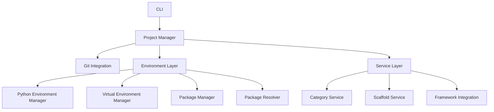
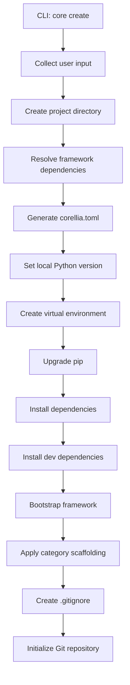
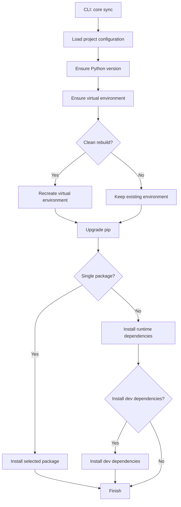
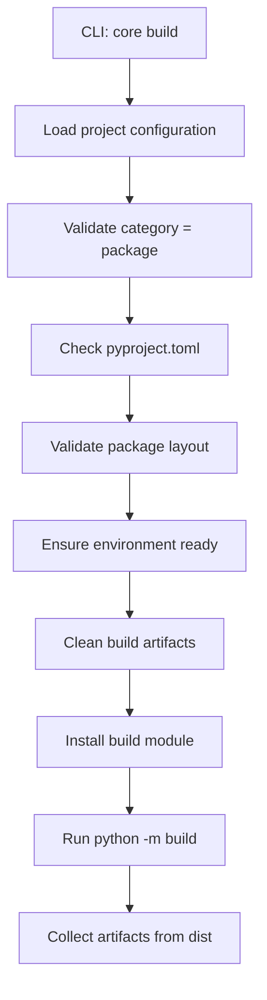
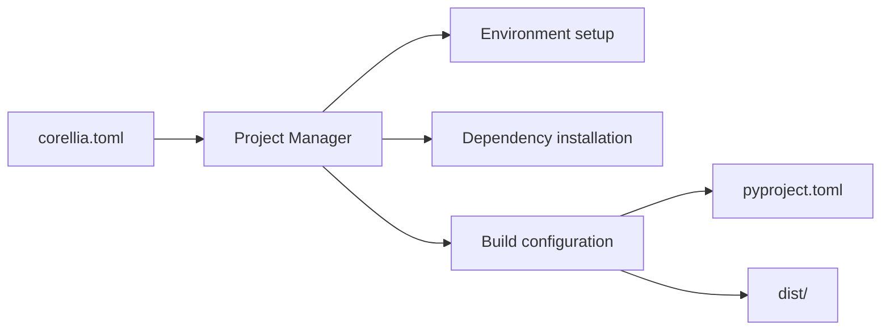

# Architecture

## Overview

**Corellia** is built as a **layered orchestration system** that coordinates multiple responsibilities involved in Python project development.

Instead of directly exposing low-level tools such as pyenv, venv, or pip, Corellia:

- abstracts them into dedicated components
- organizes them into logical layers
- orchestrates them through a central manager

---

## Design Philosophy

Corellia’s architecture is guided by the following principles:

### Separation of concerns

Each component is responsible for a single aspect of the system:

- environment management
- dependency management
- project orchestration

### Layered abstraction

Higher-level components orchestrate lower-level ones without exposing internal complexity.

### Explicit orchestration

Every operation follows a clear and traceable sequence of steps.
There is no hidden or implicit behavior.

---

## System Overview

The system can be visualized as a set of coordinated components grouped by responsibility:

### Interpretation
- **CLI Layer**
  Entry point for all user interactions.
- **Project Manager**
  Central orchestrator that coordinates all operations.
- **Environment Layer**
  Handles Python versions, virtual environments, and dependencies.
- **Service Layer**
  Handles scaffolding, category logic, and framework integration.
- **Git Integration**
  Optional layer for repository management.

---

## Core Components

### Project Manager

The `ProjectManager `is the central component of Corellia.

**Responsibilities**:

- load and validate corellia.toml
- coordinate all operations
- implement command logic
- orchestrate managers and services

All CLI commands delegate execution to this component.

### Python Environment Manager

Handles Python version management:

- interacts with `pyenv`
- ensures required Python version is installed
- sets local Python version

### Virtual Environment Manager

Handles the project virtual environment:

- creates `.venv`
- ensures environment exists
- provides Python executable path
- executes commands inside the environment

### Package Manager

Handles dependency installation:

- installs packages via `pip`
- uninstalls packages
- upgrades `pip`

### Category Service

Handles:

- project structure generation
- category-specific logic
- build file generation (pyproject.toml)
- build artifact cleanup

### Scaffold Service

Provides utilities for:

- creating directories
- writing files
- generating templates

### Framework Integration

Handles framework-specific logic:

- framework bootstrap (e.g. Django)
- predefined scripts
- framework extensions

### Git Integration

Provides optional Git support:

- repository initialization
- repository inspection
- status reporting

---

## Execution Flows

Corellia operations follow explicit and deterministic flows.

### `core create`

### `core sync`

### `core build`

### Data Flow

Corellia is driven by a clear data flow model:

---

## Configuration-Driven Design

All behavior in Corellia originates from `corellia.toml`.

This file controls:

- environment setup
- dependencies
- scripts
- project structure
- build configuration

All other artifacts are derived from it.

---

## Managers vs Services

Corellia distinguishes between two types of components.

### Managers

Managers are:

- state-aware
- long-lived
- responsible for core system operations

Examples:

- ProjectManager
- PythonEnvManager
- VirtualEnvManager
- PackageManager

### Services

Services are:

- stateless or short-lived
- task-oriented
- used during specific operations

Examples:

- CategoryService
- ScaffoldService
- DjangoService

---

## Summary

Corellia is built as:

- a layered system
- with a central orchestrator
- composed of managers and services
- driven entirely by configuration

This architecture allows Corellia to remain simple for users and scalable over time